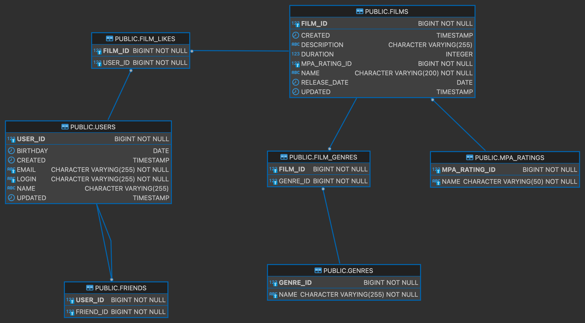

# java-filmorate

Template repository for Filmorate project.

# java-filmorate

### Схема БД

<picture>
    <source media="(prefers-color-scheme: dark)" srcset="src/main/resources/filmorate_schema.png">
    
</picture>

###

```
-- Получить топ самых популярных фильмов 
SELECT f.film_id, 
f.name, 
f.description, 
f.release_date, 
f.duration,
f.mpa_rating_id, 
mp.name AS mpa_name
FROM films f
JOIN mpa_ratings mp ON f.mpa_rating_id = mp.mpa_rating_id
JOIN (SELECT film_id, 
     COUNT(film_id) AS cnt
     FROM film_likes
     GROUP BY film_id
     ORDER BY COUNT(film_id) DESC
     LIMIT :countOfFilms) AS fl 
ON f.film_id = fl.film_id"
```
